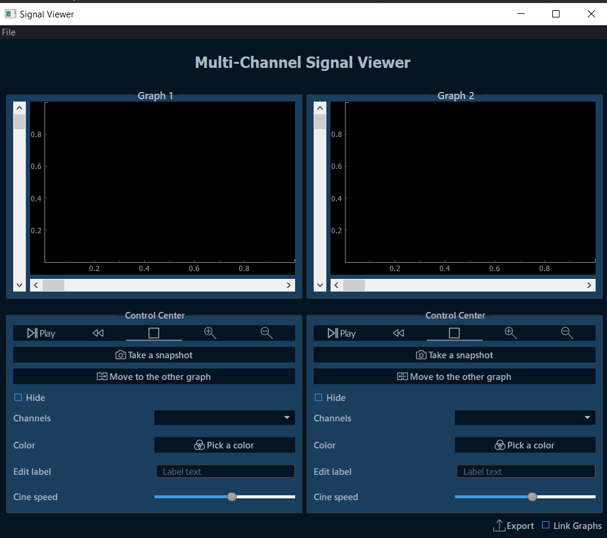
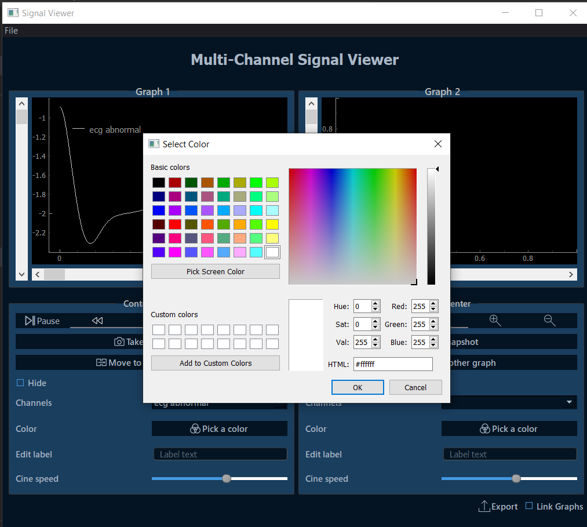
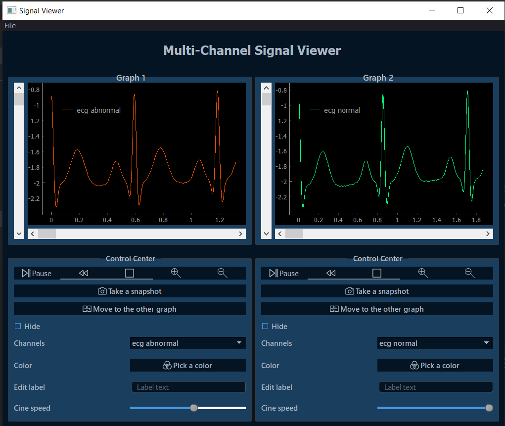

# Multi-Channel Signal Viewer

## About

> A desktop application for viewing signal files with various extensions with the ability of zooming, pausing and resuming the dynamic view, uploading multiple channels to view at the same time.

## Application Characteristics

- Browse biological signals in available channels in cine mode.
- Change signals colors.
- Add title/label for each signal.
- Show and hide signals.
- Scroll and pan signals through both sliders and mouse movements.
- Control cine speed.
- Zoom in and out.
- Play/pause/reset.
- Link the two graphs together.
- Take a snapshot for reporting.
- Export statistics of opened signals to a PDF file.

## Accepted Formats

csv, txt, xlsx, dat

## Libraries

- PyQt5
- pyqtgraph
- statistics
- reportlab
- pandas
- numpy

## Preview

## Team Members

- Sara Mohamed
- Salma Ashraf
- Manar Ashraf
- Yasmin Tarek